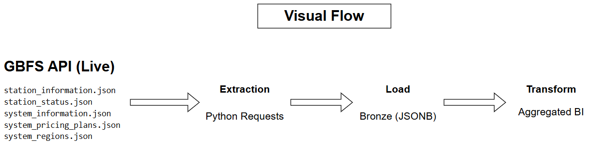

# GBFS EL → Bronze Layer Design Document

## 📋 Table of Contents
- [Overview](#overview)
- [Data Source Structure](#data-source-structure)
- [Bronze Storage Strategy](#bronze-storage-strategy)
- [Extraction Process](#extraction-process)
- [Load Process](#load-process)
- [Data Architecture And Bronze Table Schema](#data-architecture-and-bronze-table-schema)

## Overview

**Purpose**: Extract GBFS data from Toronto Bike Share API and store **raw, immutable JSONB** in PostgreSQL Bronze layer.

**Key Principles**:
- ✅ Store **complete nested JSON** (no flattening in Bronze)
- ✅ **Immutable** - every API call = new row
- ✅ Track **source lineage** (which feed, which CKAN resource)
- ✅ Ready for Silver layer flattening via SQL `jsonb_array_elements`

## Data Source Structure

### 1. CKAN Package Discovery



### 2. GBFS Feed Index (feeds.json)
```json
{
  "last_updated": 1771403901,
  "ttl": 3,
  "data": {
    "en": {
      "feeds": [
        { "name": "station_information", "url": "https://.../station_information" },
        { "name": "station_status", "url": "https://.../station_status" },
        { "name": "system_information", "url": "https://.../system_information" },
        { "name": "system_pricing_plans", "url": "https://.../system_pricing_plans" },
        { "name": "system_regions", "url": "https://.../system_regions" }
      ]
    }
  }
}
Path: root_json["data"]["en"]["feeds"]
```
###3.  Individual Feed Structure
```json
{
  "version": "3.0",
  "ttl": 10,
  "last_updated": 1771403901,
  "data": {
    "stations": [  ← ACTUAL DATA HERE (array of entities)
      {
        "station_id": "7000",
        "name": "Fort York Blvd / Capreol Ct",
        "lat": 43.639832,
        "lon": -79.395954,
        "capacity": 47,
        "rental_methods": ["key", "transitcard", "creditcard", "phone"],
        "groups": ["South", "Fort York - Entertainment District"]
      }
    ]
  }
}
```
**Key Paths:**
- station_information → data.data.stations
- station_status → data.data.stations
- system_pricing_plans → data.data.plans
- system_regions → data.data.regions

##Bronze Storage Strategy
**Design Goals**
| Goal             | Implementation                                |
| ---------------- | --------------------------------------------- |
| Immutable        | Append-only, time_ingested timestamp          |
| Schema Flexible  | Single jsonb column holds any GBFS feed       |
| Lineage Tracking | feed_type, source_name, load_batch_id         |
| Queryable        | GIN index on raw_payload, indexes on metadata |

**Bronze Table Schema**
```SQL
CREATE TABLE bronze.gbfs_feed_raw (
    id              bigserial PRIMARY KEY,
    feed_type       text        NOT NULL,  -- 'station_information'
    source_name     text        NOT NULL,  -- 'bike-share-json'
    load_batch_id   text        NOT NULL,  -- UUID per pipeline run
    file_name       text        NOT NULL,  -- 'station_information.json'
    api_url         text        NOT NULL,  -- source URL
    version         text,                -- GBFS version
    time_ingested   timestamptz NOT NULL DEFAULT now(),
    raw_payload     jsonb       NOT NULL  -- COMPLETE nested JSON
);

-- Indexes for performance
CREATE INDEX idx_feed_type_time ON bronze.gbfs_feed_raw (feed_type, time_ingested);
CREATE INDEX idx_gin_payload ON bronze.gbfs_feed_raw USING gin (raw_payload);
```
##Extraction Process
```graph LR
    A[CKAN Package API] --> B[Resource Discovery]
    B --> C[bike-share-json]
    B --> D[gbfs-specification]
    C --> E[feeds.json]
    D --> F[feeds.json] 
    E --> G[station_information]
    E --> H[station_status]
    E --> I[system_information]
    G --> J[Bronze]
```
**Python Flow (data_extraction.py)**
```Python
1. batch_id = uuid.uuid4()
2. package = get_package_metadata(BASE_URL, DATASET_ID)
3. for resource in package["result"]["resources"]:
4.     if resource.name in ["bike-share-json", "gbfs-specification"]:
5.         root_json = fetch_json(resource.url)
6.         feeds = extract_feeds(root_json)  # data.en.feeds
7.         for feed in feeds:
8.             feed_data = fetch_json(feed.url)
9.             load_feed_to_bronze(feed_data)  # JSONB insert
```

## Load Process
**Single function utils/bronze_loader.py**
```Python
def load_feed_to_bronze(feed_name, source_name, batch_id, api_url, payload):
    params = {
        "feed_type": feed_name,           # 'station_information'
        "source_name": source_name,       # 'bike-share-json'
        "load_batch_id": batch_id,
        "file_name": f"{feed_name}.json",
        "api_url": api_url,
        "version": payload.get("version"),
        "raw_payload": Json(payload)      # Full nested JSON → jsonb
    }
```
**Example Bronze Row**
| Column        | Value                                                                 |
| ------------- | --------------------------------------------------------------------- |
| feed_type     | station_information                                                   |
| source_name   | bike-share-json                                                       |
| load_batch_id | c5a7aaf0-5a7e-4f1a-bbf8-1234567890ab                                  |
| api_url       | https://tor.publicbikesystem.net/ube/gbfs/en/station_information.json |
| raw_payload   | {version: "3.0", ttl: 10, data: {stations: [...]}}                    |

##Data Architecture and Bronze Table Schema
**Data Flow**


**Data Architecture Matrix**


](<Data Architecture Matrix.drawio-1.png>)

**File Structure**
project/
├── data_extraction.py           # Main EL orchestrator
├── utils/
│   ├── el_global.py            # CKAN/GBFS helpers
│   ├── db.py                   # PostgreSQL connection
│   └── bronze_loader.py        # Bronze insert
├── data/feeds_data/            # Raw JSON files (optional)
└── docs/01_el_bronze.md       # This document

